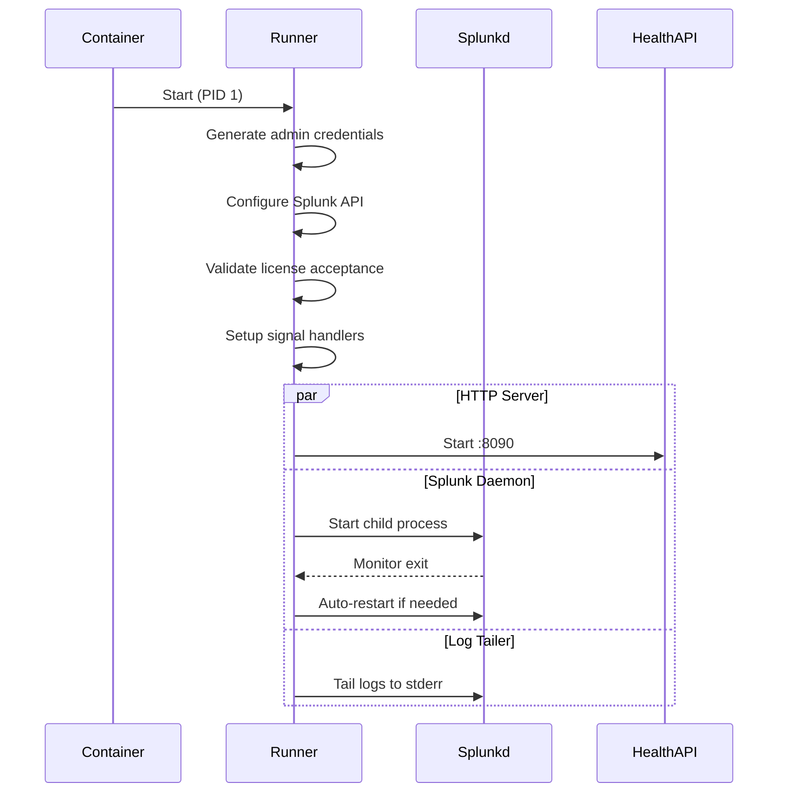

# Architecture

This document provides a comprehensive technical overview of the Splunk Universal Forwarder container image architecture.

## Table of Contents

* [Overview](#overview)
* [System Architecture](#system-architecture)
* [Runner Application](#runner-application)
* [HTTP Server](#http-server)
* [Health Checking](#health-checking)
* [Splunk Configuration](#splunk-configuration)
* [Security Model](#security-model)
* [Dependencies](#dependencies)

## Overview

### Purpose

This project provides a containerized Splunk Universal Forwarder with a custom Go runner that serves as the main container process.
The runner manages the Splunk daemon (splunkd) as a child process, providing health checks, Prometheus metrics, and automatic restart capabilities.

### Design Goals

* **Reliability:** Automatic restart of Splunk daemon on failure
* **Observability:** Prometheus metrics and health endpoints for monitoring
* **Kubernetes-native:** Liveness and readiness probes for container orchestration
* **Security:** Non-root execution, localhost-only API, minimal attack surface
* **Simplicity:** Single binary entry point with no external dependencies

## System Architecture

### Container Lifecycle



### Startup Sequence (7 Steps)

The runner executes the following initialization steps when the container starts:

1. **[Generate Admin Credentials][runner-go-generateUserSeed]**
   * Creates random 8-character password using Splunk's gen-random-passwd
   * Writes user-seed.conf with admin username and password
   * Logs password to stdout for retrieval
   * Configures healthURL for API authentication

2. **[Configure Splunk API][runner-go-enableSplunkAPI]**
   * Writes server.conf to disable SSL (performance)
   * Sets TCP mode for HTTP server
   * Restricts API access to localhost only (security)

3. **[Validate License Acceptance][runner-go-license]**
   * Checks SPLUNK_ACCEPT_LICENSE environment variable
   * Exits with error if not set to "yes"
   * Logs acceptance confirmation

4. **[Setup Signal Handlers][runner-go-signal]**
   * Creates context with SIGINT and SIGTERM handlers
   * Enables graceful shutdown of all components
   * Propagates cancellation to child processes

5. **[Start HTTP Server][runner-go-server-start]** (goroutine, non-blocking)
   * Listens on 0.0.0.0:8090
   * Registers /metrics, /livez, /healthz endpoints
   * Runs indefinitely until process termination

6. **[Start Splunk Daemon][runner-go-splunk-start]** (goroutine, non-blocking)
   * Launches splunkd with --nodaemon flag
   * Monitors process exit status
   * Auto-restarts every 5 seconds on unexpected exit

7. **[Tail Splunk Logs][runner-go-tail-start]** (blocks main goroutine)
   * Follows splunkd.log with tail -F
   * Outputs to stderr for container log visibility
   * Auto-restarts every 5 seconds on exit
   * Keeps main process alive

### Process Hierarchy

```text
/runner (PID 1) - Main container process
├── HTTP Server (goroutine) - Port 8090
├── splunkd (child process) - Port 8089
│   └── Splunk components (managed by splunkd)
└── tail -F (child process) - Follows splunkd.log
```

The runner acts as the main container process.
The HTTP server runs as a goroutine within the runner.
Both splunkd and tail run as child processes spawned by the runner.

## Runner Application

The [runner][runner-go] is a Go application with the following responsibilities:

* **Process Management:** Acts as main container process, manages child processes
* **Initialization:** Generates credentials and configures Splunk before startup
* **Health Monitoring:** Queries Splunk health API and exposes status
* **Metrics Export:** Converts component health to Prometheus format
* **Auto-Restart:** Detects and restarts failed Splunk daemon
* **Log Aggregation:** Tails splunkd.log to container stderr
* **Signal Handling:** Graceful shutdown on SIGTERM/SIGINT

## HTTP Server

The runner exposes an HTTP server on port 8090 with three endpoints.

### Endpoint: GET /metrics

**Purpose:** Prometheus metrics for Splunk component health

**Metric Name:** `splunk_forwarder_component_unhealthy`

**Metric Type:** Gauge

**Labels:**

* `component`: Flattened component path (e.g., "DispatchManager/SearchScheduler")

**Values:**

* `0`: Component is healthy (green status)
* `1`: Component is unhealthy (yellow or red status)

**Example Response:**

```text
# HELP splunk_forwarder_component_unhealthy 
# TYPE splunk_forwarder_component_unhealthy gauge
splunk_forwarder_component_unhealthy{component="DispatchManager"} 0
splunk_forwarder_component_unhealthy{component="DispatchManager/SearchScheduler"} 0
splunk_forwarder_component_unhealthy{component="IndexProcessor"} 0
```

### Endpoint: GET /livez

**Purpose:** Kubernetes liveness probe - detect crashed processes

**Implementation:** Checks if splunkd process has exited via cmd.ProcessState

**Use Case:** Kubernetes restarts container if liveness probe fails

### Endpoint: GET /healthz

**Purpose:** Kubernetes readiness probe - detect unhealthy components

**Implementation:** Queries Splunk health API, returns 200 only if all components green

**Verbose Mode:** Add `?verbose` query parameter for per-component health status details

**Use Case:** Kubernetes routes traffic only to ready pods

## Health Checking

### Mechanism

The runner queries Splunk's internal health API to determine component status.

**API Endpoint:** `http://127.0.0.1:8089/services/server/health/splunkd/details`

**Authentication:** Basic auth with auto-generated admin credentials

**Response Format:** JSON with nested feature tree

**Example API Response:**

```json
{
  "entry": [{
    "content": {
      "health": "green",
      "features": {
        "Dispatch Manager": {
          "health": "green",
          "features": {
            "Search Scheduler": {
              "health": "green"
            }
          }
        }
      }
    }
  }]
}
```

### Status Types

Splunk health statuses follow a traffic light model:

* **Green:** Component is healthy and functioning normally
* **Yellow:** Component is degraded but operational
* **Red:** Component has failed

The runner treats only "green" as healthy; yellow and red both map to unhealthy (metric value 1).

## Splunk Configuration

### Auto-Generated Configs

The runner creates two configuration files before starting Splunk:

#### user-seed.conf

**Path:** `/opt/splunkforwarder/etc/system/local/user-seed.conf`

**Purpose:** Defines admin user credentials for first startup

**Content:**

```ini
[user_info]
USERNAME = admin
PASSWORD = <8-char-random>
```

**Generation:** Password created via `splunk gen-random-passwd` command

**Splunk docs:** [user-seed.conf]

#### server.conf

**Path:** `/opt/splunkforwarder/etc/system/local/server.conf`

**Purpose:** Configures Splunk management API

**Content:**

```ini
[sslConfig]
enableSplunkdSSL = false
[httpServer]
mgmtMode = tcp
acceptFrom = 127.0.0.1/8
```

**Settings Explained:**

* `enableSplunkdSSL = false`: Disables SSL for performance (localhost-only API)
* `mgmtMode = tcp`: Uses TCP mode instead of Unix socket
* `acceptFrom = 127.0.0.1/8`: Restricts API access to localhost for security

**Splunk docs:** [server.conf]

## Security Model

### Non-Root Execution

The container runs as the `splunkfwd` user (created during Splunk UF installation).

**Effect:**

* Limits blast radius of potential container escape
* Prevents privilege escalation attacks
* Aligns with Kubernetes security best practices

### Credential Management

Admin password is randomly generated on each container startup.

**Process:**

1. Generate 8-character random password
2. Write to user-seed.conf (read by Splunk on first start)
3. Log password to stdout (for operator retrieval)
4. Configure healthURL for API authentication

**Retrieval:**

```bash
podman logs <container-id> 2>&1 | grep -A 1 "generated password"
```

### API Access Control

Splunk management API is restricted to localhost only.

**Configuration:** `acceptFrom = 127.0.0.1/8` in server.conf

**Effect:**

* API only accessible from within the container
* No external network exposure
* Health checks work (runner runs in same container)

## Dependencies

### Runtime Dependencies

**Prometheus Client:**

* Library: `github.com/prometheus/client_golang v1.23.2`
* Purpose: Metrics exposure in Prometheus format
* Usage: Gauge metrics for component health

**Splunk Universal Forwarder:**

* Version: 10.2.0 (hash: d749cb17ea65)
* Package: RPM from download.splunk.com
* Installation: Via rpm -ivh in [Dockerfile][dockerfile]

**System Packages:**

* `libsemanage`: SELinux policy management
* `shadow-utils`: User/group management
* `findutils`: File search utilities
* `procps`: Process utilities
* `wget`: Download Splunk RPM

**Base Image:**

* `registry.access.redhat.com/ubi9/ubi-minimal:9.7-1771346502`
* Red Hat Universal Base Image 9 (minimal variant)

### Build Dependencies

**Go Toolchain:**

* Version: 1.25.7 (from boilerplate image)
* CGO: Enabled for Linux builds

**Builder Image:**

* `quay.io/redhat-services-prod/openshift/boilerplate:image-v8.3.2`
* Provides Go compiler and build environment

[dockerfile]: ../build/Dockerfile
[runner-go-enableSplunkAPI]: ../runner.go#L170-L183
[runner-go-generateUserSeed]: ../runner.go#L154-L168
[runner-go-license]: ../runner.go#L329-L334
[runner-go-server-start]: ../runner.go#L340
[runner-go-signal]: ../runner.go#L337
[runner-go-splunk-start]: ../runner.go#L344-L349
[runner-go-tail-start]: ../runner.go#L353-L356
[runner-go]: ../runner.go
[server.conf]: https://help.splunk.com/en/splunk-enterprise/administer/admin-manual/10.2/configuration-file-reference/10.2.0-configuration-file-reference/server.conf
[user-seed.conf]: https://help.splunk.com/en/splunk-enterprise/administer/admin-manual/10.2/configuration-file-reference/10.2.0-configuration-file-reference/user-seed.conf
